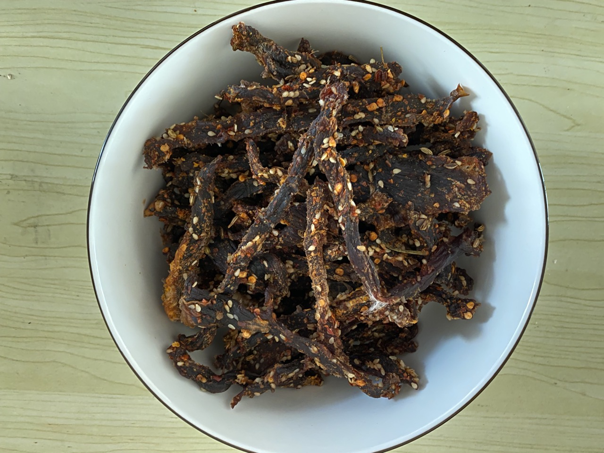

## 前言

最近制作了一些牛肉干，感觉味道还可以，来分享一下。

先上成品图：

## 原材料

### 必备

牛肉、香油、生抽/老抽、蚝油、料酒、姜

### 可选

干辣椒、芝麻、八角、桂皮、香叶、白糖、橙子皮、柚子皮、白酒

## 过程
PS: 配料计量单位：汤勺-15ml

1. 将牛肉切成长条状 
2. 将牛肉加水或者料酒放入冰箱浸泡3个小时泡出血水(这一步也可以跳过)
3. 按一斤牛肉的比例进行调料添加：1/3勺香油、一勺生抽、一勺蚝油、两勺料酒、5克姜、半勺干辣椒、半勺芝麻、1个八角、桂皮5克、香叶2片、半勺白糖、橙子皮跟柚子皮切成细条状(量随意)、白酒半勺(喜欢酒香味的可以提升到一勺)
4. 在碗里搅拌均匀，用保鲜膜封好放入冰箱冷藏1至两天。这一步是入味

 
5. 将牛肉在烤架上摆放均匀，上下火170度烤25分钟。注意要在下面用盘子接住沥出物  
6. 拿出来用风扇吹24-36小时，然后收入碗中用保鲜膜封好放入冰箱，随吃随取。这个风扇吹的时间越长，牛肉干越硬，保存的时间越长(其实几天就吃完了，所以最终还是看口感)，所以口感以及保存时间这块各位可以通过这个时间自己把控。

## 注意点
1. 橙子皮跟橘子皮的香味在腌制的时候比较明细，在成品里，其味道很细微。
2. 白酒的味道在成品里也会比较浓，所以，如果不喜欢白酒的味道，千万不要放。
3. 如果放葱进行腌制，成品也会有一股很浓的葱味，体验不好，建议不要放
4. 香油能为成品增香
5. 腌制的过程尽量不要超过两天，超过了料会逐渐有腐败的味道

## 总结
首先，我觉得成品的味道比市面上我曾买过的那些风干牛肉要好吃很多，而且干净卫生，吃起来方向。另外制作过程也很简单，不需要花多少时间精力。而且在这个过程中也可以自己慢慢摸索调整这个味道，也是挺有意思的一件事。